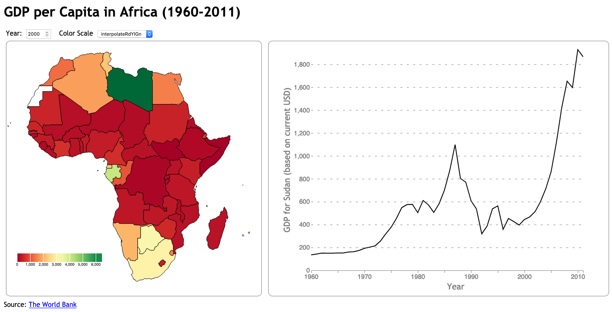
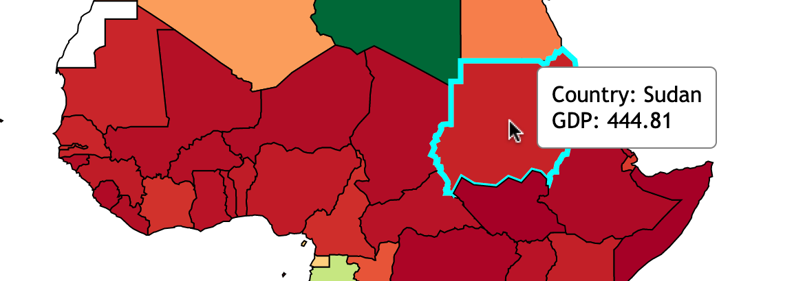

# Linking D3 Charts and Adding Interactivity

The purpose of this homework is to give you practice linking separate visualizations together in D3. By the end of this assignment you should learn how to:

* Update a second chart based on interaction within the first
* Use mouse events
* Update data and color scheme via html elements
* Add tooltips to charts
* Create a legend
* Stylize axes on a chart

## Data Description

The data for this assignment comes from the World Bank ([link](https://databank.worldbank.org/source/africa-development-indicators)). It shows, from 1960-2011, the GDP per capita of countries in Africa (based on current USD). 

* `data/Data_Extract_From_Africa_Development_Indicators.xlsx` is the excel file generated and downloaded from The World Bank website using their DataBank interface.
* `data/africa_gdp_per_capita.csv` is the formatted csv file you'll use in the interface. Note that some countries have misssing data for some years (stored as empty strings).
* `data/africa.geojson` is the geojson file used to create the map (ie, the country shapes).

> 🔍 **Hint:** When drawing chloropleth maps in D3, we generally load two datasets. Here, the geojson file describes the shape and location of each country as a path. The csv file provides the tabular data of each country's GDP per year. The data is loaded This page may serve as a useful reference, both on this asignment and in the future: [Making a Map in D3.js v.5](https://datawanderings.com/2018/10/28/making-a-map-in-d3-js-v-5/)

## To start the assignment

* Clone this code template to your local machine.
* Start a local server and open the **index.html** page.
* Modify the given code according to the instructions below to achieve an interface like the following screenshot.
* Commit and push the code back to this repository to submit it. The finished chart in **index.html** should look like this:

A short video file has been uploaded to demonstrate the completed homework: [YouTube](https://youtu.be/PheL6EQ4QPk). You are expected to have the interactions in your homework as shown in the video.

## Step 0: Starting code

When you first download and run the code, you should see the map in the left svg (no color legend), but the right svg will be blank. The first thing is to add your name, email, and student ID at the top.

## Step 1: Make the map update based on the year

The map of Africa initially shows the GDP per capita for each country for the year 2000. Make is so that when the text in the input box (id=`year-input`) is changed, the map updates to that show GDP values for that year on the map.

## Step 2: Make the color scale interactive + add 2 scales + add a legend

(1) Likewise, make it so that when the color scale dropdown (id=`color-scale-select`) is changed, the map's color scale updates to the selection. (2) Then, pick two additional sequential scales (see the D3 [scale-chromatic page](https://github.com/d3/d3-scale-chromatic) for examples) and add them as options to color the map. (3) Finally, add a color scale legend at approximately the same place (and with the same stylings) as shown in the screenshot above. This example may be used as a reference: [link](https://observablehq.com/@tmcw/d3-scalesequential-continuous-color-legend-example). In the screenshot, my scale is 200 width and 20 height. The scale's domain should go from 0 to the max GDP value for the currently selected year.

## Step 3: Add a hover tooltip to the map

When the user hovers or moves the mouse over a country on the map, higlight the country with a cyan-colored border and show a hover tooltip to the right of the mouse.

The border of the hovered country should be cyan with stroke-width 4, and should go back to the "non-highlighted" styling when the country is no being longer hovered upon (black stroke of width=1). 

The tooltip should show the current country and its GDP value, styled like the below screenshot. You'll want to use mouse events (`mouseover`, `mousemove`, and `mouseout`) to control the functionality. The tooltip should follow the mouse as it moves over a country (see demo video for an example).

> 🔍 **Hint:** There are multiple ways to implement these. For the border highlighting, you could manually change the hovered country's properties, or yuo could apply a CSS class at `mouseover` that is removed on `mouseout`. See this link for info on setting CSS stylings in D3: [D3 attr(), style() and classed()
](https://www.carlosrendon.me/unfinished_d3_book/d3_attr.html).  For the tooltip, one option is defining a div that's hidden unlesss you are hovering on a country; then you populate the div with the appropriate information. See this page for an example: [Show data on mouse-over with d3.js](https://medium.com/@kj_schmidt/show-data-on-mouse-over-with-d3-js-3bf598ff8fc2).

## Step 4: Display a line chart when a user clicks on a country

When the page first loads, the `#linechart` div is blank. When a user clicks on a country, a line chart should be draw in this panel showing the GDP over time for that country from 1960-2011.

* Use the function `drawLineChart` to draw the line chart for the provided `country` argument using the `timeData` data structure. If a country has missing values, it's okay for the line to default to `0` numbers for those years (the screenshot in Step 5 shows an example of this).
* The x axis, labeled `Year`, should always go from 1960-2011 (even if the country has missing values over that time). The y axis should go from 0 to the max GDP value for the provided country over the timespan. The y axis label should state `GDP for (current country) (based on current USD)`.
* We've provided you a basic set of variables that you may find useful for positioning and padding your chart, see `lineInnerWidth`, `lineInnerHeight`, and `lineMargin`. (These are what we used when creating the screenshots.) Try to make the chart's size and aspect ratio consistent when the screenshots.
* The line chart line should be black with stroke size=2.
* Style axes in the following ways: (1) Axis lines, ticks, tick labels, and axis labels should be gray in color. (2) The x-axis line should be a solid color should with tick marks every 5 years and tick labels every 10 years (1960, 1970, etc.). (3) Horizontal dashed gray lines should extend from the y-axis ticks across the chart. (We use a dasharray pattern of `5,10' in the screenshot, but you may choose your own dash pattern.) (4) Tweak the size of text tick labels and axis labels so that are similar to the screenshot above. This link may be helpful: [Styled Axes](https://observablehq.com/@d3/styled-axes).

## Step 5: Add a hover tooltip for the line chart

Similar to step 3, when the user hovers over the line chart's drawing area, show two items to indicates to the user the year and corresponding GDP value.

* A focus circle should append to the line based on the year timestep that the mouse is on. The circle should have a radius of 10 and a black border. This link shows an example of how to implement a focus circle: [Line chart with cursor showing exact value](https://www.d3-graph-gallery.com/graph/line_cursor.html).

* A tooltip, styled like what is shown on the map, should show the year and GDP based on the year the mouse if hovering on. The tooltip can either be offset from the mouse cursor (like as shown in the screenshot), or it can be fixed next to the focus circle.

When the user is not hovering over the line chart area, the focus circle and tooltip should be hidden. As the mouse moves left or right over the chart, the year and GDP values should update appropriately. 

> 🔍**Hint**: A tooltip is just a DOM element that gets moved around on the page. Consider using the same tooltip for both charts.

## Completion

Once you've finished all of the steps and have the charts looking and interacting like what is shown in the video, commit and push your code by the deadline. 

